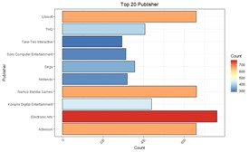
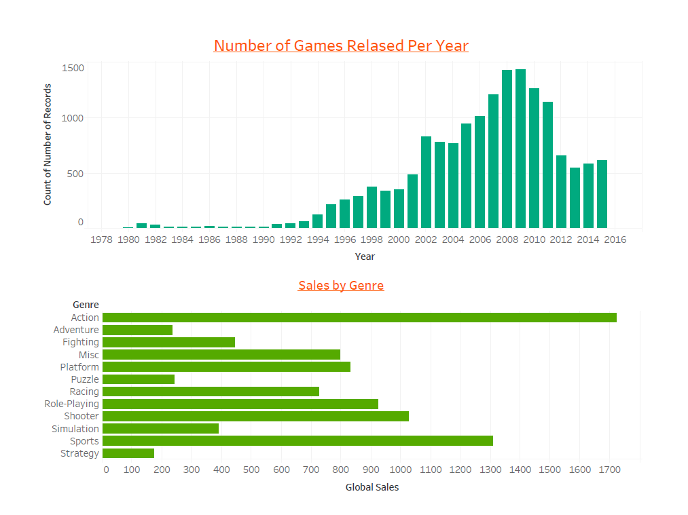
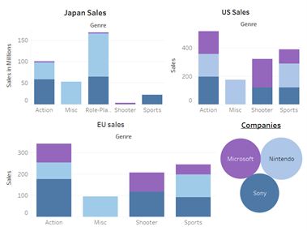

# Visualization Analytics

## Project -1  [Video Games Sales By Genre](https://github.com/gauthamikuravi/Visualization-Analytics/blob/master/Assignments/Play_Station_GameAnalysis.R): 

## **Purpose:**
**To find the sales of the 3 Top  Companies in different countries . who is the biggest player in Gaming Industry and why?** 
- [x] The project consists of One dataset and its respective visualizations.

## **Description of Dataset:**

- [x] Number of Games Released from 1978 to 2016 shows that Count Increased after the year 2000 with the sixth generation of consoles emerged.   During this period,console based games were released  became major aspects of gaming culture. 

  

- [x] From 2010,there is decrease in trend because of challenge and massive expense of creating consoles that were graphically superior to the, then, current generation, with Sony and Microsoft still looking to recoup development costs on their current consoles and the failure of content creation tools to keep up with the increased demands placed upon the people creating the games. Action and Sports are more dominating genre in Video games.

  

Above graph shows sales data of three companies over the years. Sony and Nintendo are Japanese multinational companies with its headquarters in Tokyo,Japan and  Microsoft  is US multinational company. While Japan is a big market for video games, Microsoft doesn’t rely on Japanese consumers. Sony has many of its games in both Action and sports Genre with its games based on culture aspects. 

## **Grouped the Console based games based on their Vendors:**

- [x] Sony and Microsoft seems dominating in North America. Nintendo and Sony   seems dominating in Japan  in Videogame Industry. Also Sony being major seller in EU region.  We could say Action and sports being top  most played games by the consumers in all the many  regions, Sony and Nintendo has released many games on sports and action, which made them top  sellers in Video Gaming Industry

  

## **Conclusion:**
Below is the gist of all the insights gathered from the dataset:
- [x] Of the three major video game console makers — Sony, Microsoft, and Nintendo — Sony is in a comfortable lead in all three regions  because Percentage  of the games sold  by Sony are  Action and sports  based games. Also Sony is known for its  quality music in action sports. 
- [x] Electronic Arts is the top gaming release platform.
- [x] Sales seems to be in the downward trend after 2008 and the trend is continuing till 2015
- [x] 19.9 % of the total games released were from Action genre followed by Sports contributing to 14.12% of the games.
- [x] The dominance of the Action games in the year 2012 where other genre releases have shown a downward trend compared to previous year ,Action games seemes to have a spike from previous year.
- [x] Sports is dominating the Global Sales.Individually , it has minted out higher in Europe,and North America.In Japan,Role Playing games have more value for money.While,racing games comes second in Europe,in North America,Platform games occuply the second slot.

## **Reference:**
https://www.kaggle.com/gregorut/videogamesales

###########################################################################################################################
# Project -2 Text Mining with Skytrax Dataset 
NLP project to find the reviews of the Users by text mining.Most frequently used words to  classify the best airport.Used R code to get the results.
DATASET:
Skytrax offers their own ranking of the world’s best airports based on a “comprehensive” assessment that goes beyond user reviews, 
decided it would be interesting to take a deeper look at the ratings users input on the website.
By ranking airports based on “overall rating.”  Reviewers are asked to rank airports on a one to ten scale.

  

